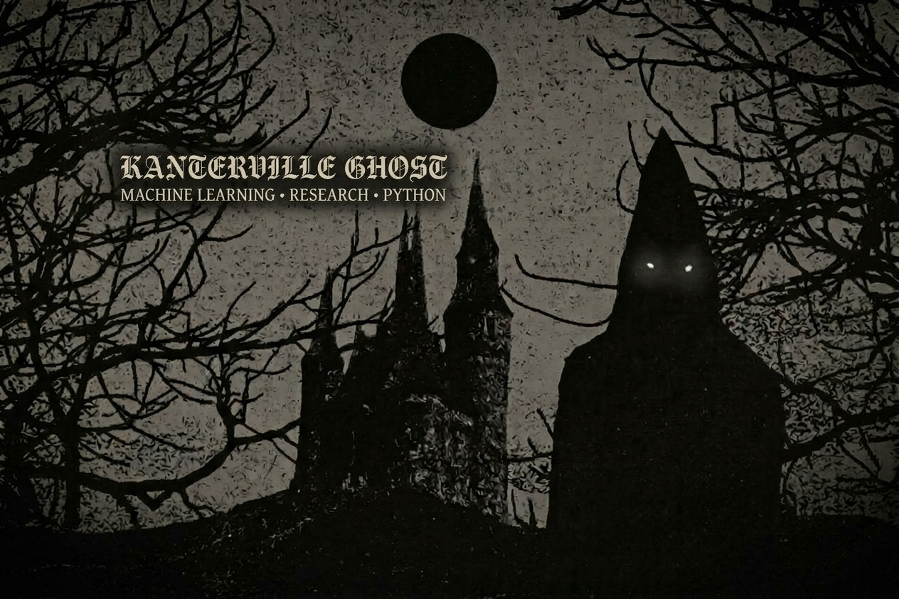

<!-- ═══════════════ HERO ═══════════════ -->

 

<!--  -->

<!--  

☾   MACHINE LEARNING  ·  RESEARCH  ·  PYTHON   ☾ -->

 

  
  
  
  

 

 

<!-- ═══════════════ ABOUT ═══════════════ -->

### between mathematics & machines

<i>small data · strange models · quiet experiments</i>

 

ML researcher and Python developer focused on **small data** and **conformal prediction** — models and libraries that stay honest when samples are few.

Currently at <b>Beijing Institute of Technology</b>, Computer Science.

 

 

<!-- ═══════════════ Ⅰ · ARCHIVE ═══════════════ -->

## Ⅰ · Projects

SELECTED WORKS · 2026

  

### 01 · SmallGBM

<i>gradient boosting for small datasets</i>

**0.9101** ROC-AUC  ·  **13.4 ms** fit  ·  **0.29 ms** predict  ·  **22** datasets

 

  

### 02 · SmallMLP

<i>non-parametric regression & classification with conformal sets</i>

**NON-PARAMETRIC**  ·  **CONFORMAL SETS**  ·  **SMALL DATA**

 

 

 

<!-- ═══════════════ Ⅱ · RESEARCH ═══════════════ -->

## Ⅱ · RESEARCH

PREPRINTS · PUBLICATIONS

  

### SmallGBM

<i>Gradient Boosting with Robust Leaf Regularization for Small-Sample Tabular Data</i>

ZENODO · 2026  ·  Emelyanov, I.  ·  DOI: 10.5281/zenodo.21934674

 

  

### SmallMLP

<i>Non-Parametric Regression & Classification with Conformal Sets</i>

PREPRINT · IN PREPARATION  ·  Emelyanov, I.  ·  PyPI · smallmlp

 

 

 

<!-- ═══════════════ Ⅲ · ARSENAL ═══════════════ -->

## Ⅲ · Skills

TOOLS · DAILY DRIVERS

  

<b>LANGUAGES</b>&nbsp;&nbsp;&nbsp;

  

<b>ML / DATA</b>&nbsp;&nbsp;&nbsp;

  

<b>BACKEND / TOOLS</b>&nbsp;&nbsp;&nbsp;

 

 

<!-- ═══════════════ STATS ═══════════════ -->

 

 

<!-- ═══════════════ FOOTER ═══════════════ -->

 

☾   BEIJING · CHINA · 2026   ☾

